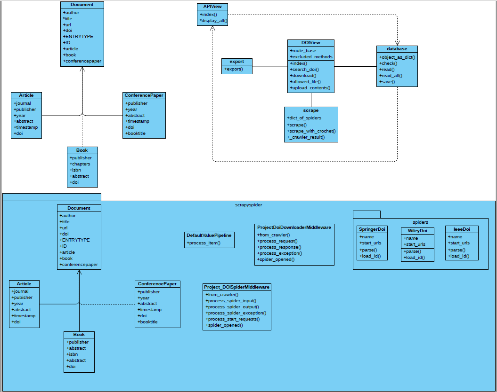
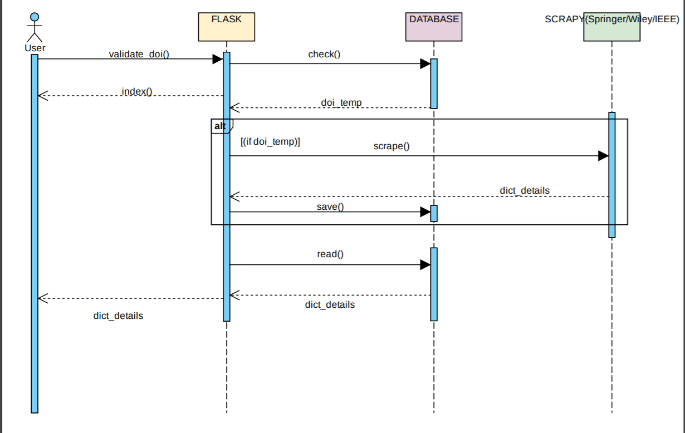

INTRODUCTION
------------

The project is an api for extracting bibliographical data of publications published in ieee.org, springer.com, onlinewiley.com using Digital Object Identifier (DOI). Bibliographical data belonging to books, journal articles, book chapters and conference papers can be obtained using the respective DOI’s. Users can input multiple DOI’s, can upload csv and json files containing DOI’s can be uploaded. Users can also download the bibliographical data in json and biibtex formats

.. image:: _static/first.PNG

Fig 1. User can upload files with DOI’s or input DOI’s

Working of Project DOI
----------------------
Running the server :
At first the project files should be pulled from the git repository to run the application. The link of the repository for Project DOI is
https://mygit.th-deg.de/nb15766/project_doi_
Once the files are pulled to the local system the website should be made to a functioning site. For this we need to run the application locally in our personal computer or laptop.  For this we need to access the local host and the website up and running. We need the local computer should be pre-installed with python, Flask and Scrapy. The commands can be access through command prompt or any command windows of choice. During the sample run we used command prompt.
Once the files are obtained, run the command python doi_app.py after setting the correct path as shown in Fig 2.

.. image:: _static/second.PNG

Once the file path is obtained, we give the command to run the server which is “python doi_app.py”. If the command is executed successfully a development server is created with IP address http://127.0.0.1.:5000/ as shown in Fig. 2. This confirm that the website can be accessed through a web browser of choice through this IP address. the development server can be quitted by using CNTRL+C. The IP address is given in the browser which will direct to the home page as show in Fig 1

Requirements
------------

* crochet==1.12.0
* Flask==1.1.2
* Scrapy==2.1.0
* SQLAlchemy==1.3.17
* bibtexparser~=1.1.0
* alembic~=1.4.2
* Flask-Classful==0.14.2
* Sphinx==3.1.2

Elements Of Bibliographical Data
--------------------------------

The following data for the different types of publication can be obtained.

.. image:: _static/third.PNG

Obtaining the Data
------------------

Enter the DOI in the text area and press the submit button.

.. image:: _static/fourth.PNG

UML Class Diagram
-----------------

In class diagrams, we work with the following elements:
Class: A class represents a relevant concept from the domain, a set of persons, objects, or ideas that are depicted in our website.

Attribute: An attribute of a class represents a characteristic of a class that is of interest for the user of the website.

Operation: In a UML class diagram, we can add operations to classes and interfaces. An operation is a method or function that can be executed by an instance of a class or interface.

Visibility (+ and -): Use visibility markers to signify who can access the information contained within a class. Private visibility, denoted with (-) sign, hides information from anything outside the class partition. Public visibility, denoted with a (+) sign, allows all other classes to view the marked information.

Generalization (→): Generalization is a relationship between two classes. Is shows strong relation.

Association (―): An association indicates that objects of one class have a relationship with objects of another class.

Composition (Not-Shared Association): There is a strong lifecycle dependency between the two classes.

Multiplicity: A multiplicity allows for statements about the number of objects that are involved in an association.

Fig above shows the complete UML class diagram for our project. Document class has three sub classes, Book, Article and ConferencePaper, which contain the rest of the bibliographical data, which are particular for the publications. DOIView Class is the core class of the project. The input is obtained from the user. After validating the input, the list of DOIs first searched in the database. If the DOI is present in the database, the data is read and displayed and made available for download in json and bibtex formats. DOI’s can be uploaded by csv and json format. The DOI’s are parsed from the file and converted into a list. After validating the DOI’s the spiders are called one after another depending on the website of publication.
If the DOI/s is not present in the database, the Scrape class object is initialized. Using the url obtained from the doi. get_real_url_from_doi(), the particular spider can be called . Currently bibliographical data of papers published by ieee, springer and wiley can be accessed.
Consider some synchronous do-one-thing-after-the-other application code that wants to use event-driven Twisted-using code.We have two threads at a minimum: the application thread(s) and the reactor thread. There are also multiple layersnof code involved in this interaction
 Twisted code: Should only be called in reactor thread. This may be code from the Twisted package itself, or more likely code you have written that is built on top of Twisted.
 @wait_for/@run_in_reactor wrappers: The body of the functions runs in the reactor thread... but the caller should be in the application thread.The application code: Runs in the application thread(s), expects synchronous/blocking calls. dispatcher.connect will connect to the dispatcher that will kind of loop the code between these two functions.crawl_runner.crawl will connect to the our particular spider function based on the domain name in our scrapy file and after each yield will pass to the crawler_result function. The setting.py is applied to the crawl runner.
The data is extracted from the meta data present in the website. From springer and wiley , the data is obtained from the meta tags. For the papers published by ieee, the data is obtained from the javascript variable (global.document.metadata) present in the website using regex. ID is created by concatenating author and year.

Sequence Diagram
----------------
A sequence diagram is a graphic depiction of the interactions among the elements of our application. User is an actor. Activity of the actor can define by using use case. A user provides input DOI and the data is obtained by scraping if the input is a valid doi.

.. toctree::
   :maxdepth: 2
   :caption: Contents:

   rst/doi_app
   rst/project_doi
   rst/project_doi.scrapyspider
   rst/project_doi.scrapyspider.spiders

.. automodule:: testing
   :members:

Indices and tables
------------------

* :ref:`genindex`
* :ref:`modindex`
* :ref:`search`
